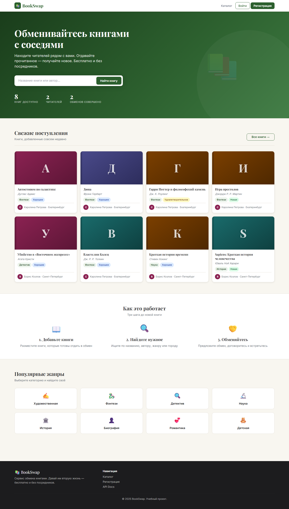
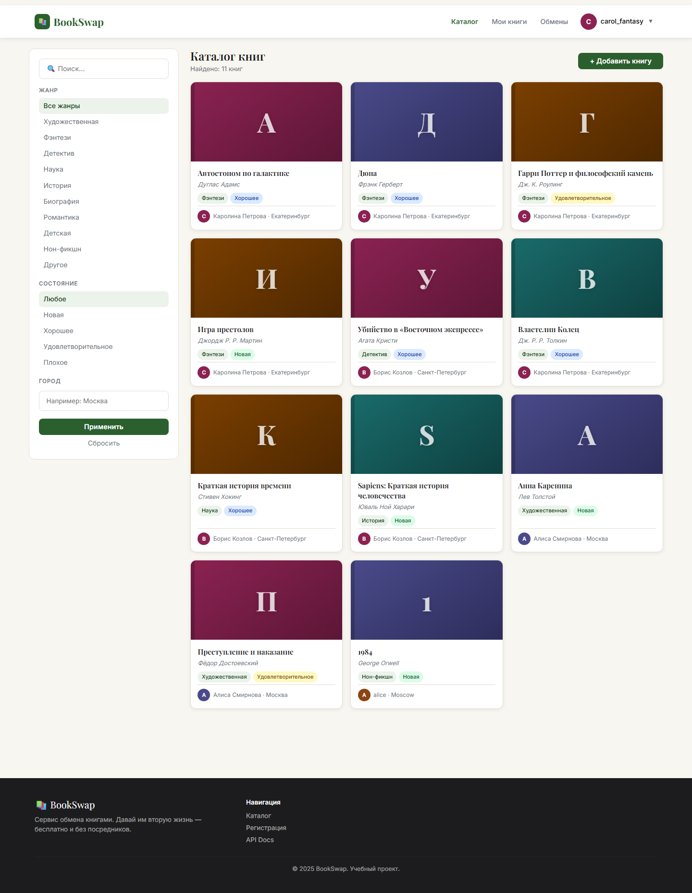
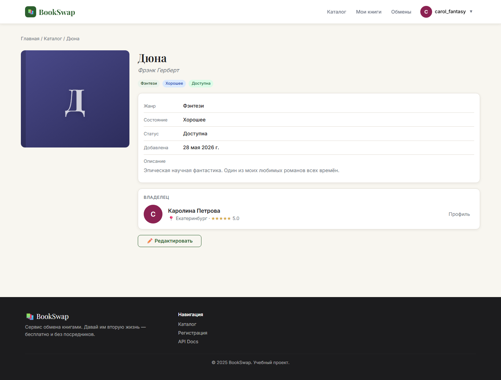
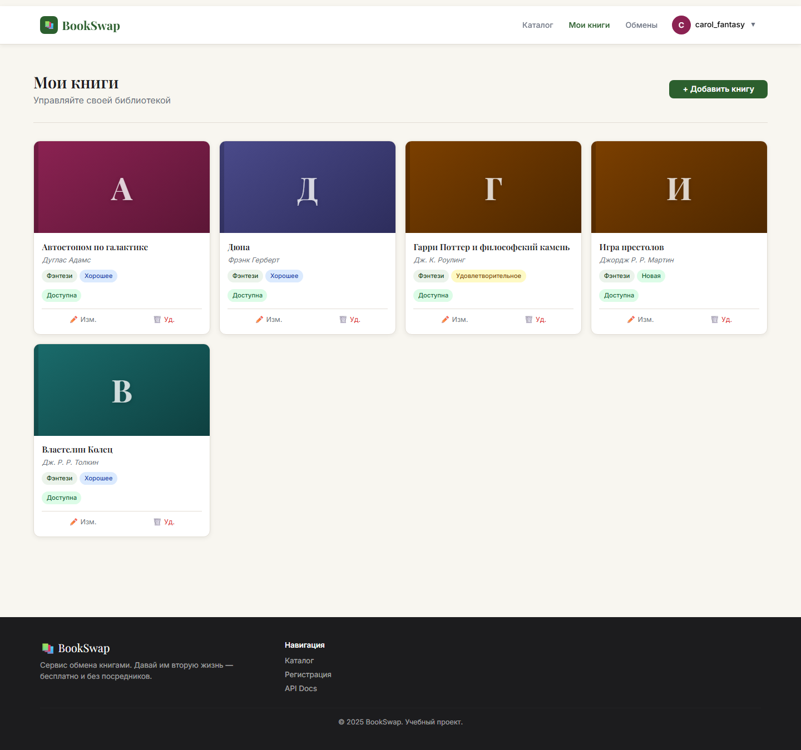
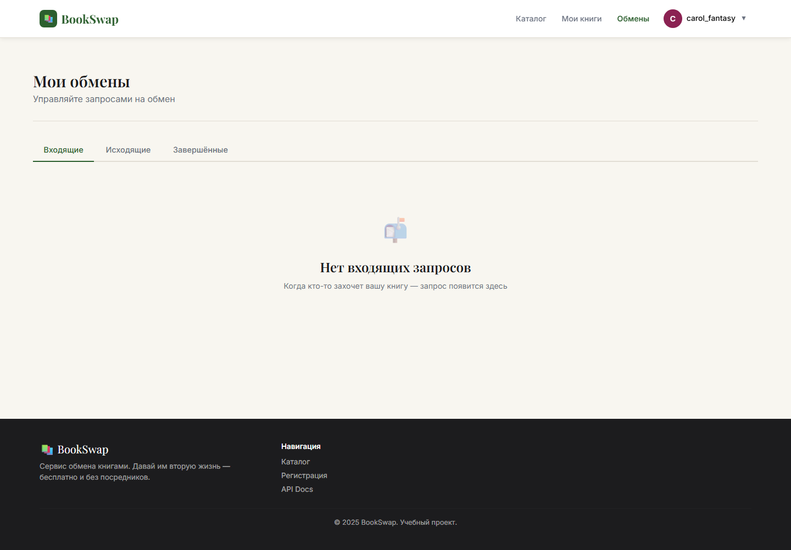
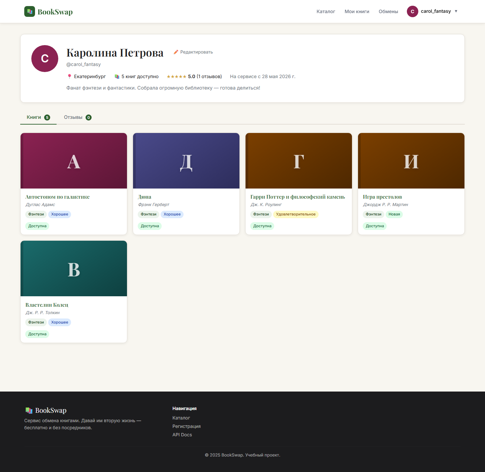

# 📚 BookSwap — Сервис обмена книгами

<div align="center">


**Веб-платформа для бесплатного обмена книгами между пользователями**

*Учебный проект по дисциплине «Сервисно-ориентированные системы»*

[🚀 Запуск](#-запуск-проекта) · [📖 API Docs](#-api-документация) · [👥 Тест-данные](#-тестовые-данные) · [📝 User Stories](#-user-stories-invest)

</div>

---

## 📸 Скриншоты

### Главная страница — герой, свежие книги, жанры


### Каталог — поиск, фильтры по жанру / состоянию / городу


### Страница книги — информация, владелец, кнопка обмена


### Мои книги — управление своей библиотекой (CRUD)


### Обмены — три вкладки: Входящие / Исходящие / Завершённые


### Профиль — рейтинг, книги, отзывы, редактирование


### Регистрация


---

## 🎯 О проекте

**BookSwap** — сервис, позволяющий пользователям размещать свои книги и обмениваться ими с другими читателями. Принципы: бесплатно, без посредников, с системой рейтингов и отзывов.

### ✅ Реализованный функционал

| Функция | Описание |
|---|---|
| 🔐 Аутентификация (JWT) | Регистрация, вход, защищённые маршруты |
| 📚 Каталог книг | Поиск по тексту, фильтры по жанру / состоянию / городу, пагинация |
| ✏️ Управление книгами | Добавление, редактирование, удаление своих книг |
| 🤝 Обмены | Полный цикл: предложить → принять → завершить / отклонить / отменить |
| ⭐ Отзывы и рейтинги | Оценка 1–5 звёзд после завершённого обмена, пересчёт рейтинга |
| 👤 Профили | Просмотр чужих профилей, редактирование своего |
| 📖 Swagger / ReDoc | Автогенерируемая документация API |
| 📱 Адаптивный дизайн | Работает на любом экране |

---

## 🛠 Технологии

### Backend
| | Технология | Версия | Назначение |
|---|---|---|---|
| 🐍 | **Python** | 3.11+ | Язык программирования |
| ⚡ | **FastAPI** | 0.115.5 | Web-фреймворк, REST API |
| 🗄️ | **SQLAlchemy** | 2.0.36 | ORM, работа с базой данных |
| 💾 | **SQLite** | встроенная | База данных (без установки) |
| ✅ | **Pydantic** | 2.10.3 | Валидация данных, схемы запросов/ответов |
| 🔑 | **python-jose** | 3.3.0 | Генерация и верификация JWT-токенов |
| 🔒 | **bcrypt** | 4.3.0 | Хеширование паролей |
| 🚀 | **Uvicorn** | 0.32.1 | ASGI-сервер |

### Frontend
| | Технология | Версия | Назначение |
|---|---|---|---|
| ⚛️ | **React** | 18.3 | UI-библиотека (компоненты, хуки) |
| ⚡ | **Vite** | 6.4 | Сборщик и dev-сервер с HMR |
| 🧭 | **React Router** | 6.x | Клиентская SPA-маршрутизация |
| 🎨 | **Bootstrap** | 5.3 | CSS-сетка и утилиты |
| 🖌️ | **CSS Variables** | — | Дизайн-система (тема, цвета, типографика) |

---

## 🏗 Архитектура

```
┌──────────────────────────────────────┐
│         Браузер (React SPA)          │
│                                      │
│  Home · Catalog · BookDetail         │
│  MyBooks · Exchanges · Profile       │
│  Login · Register                    │
└───────────────┬──────────────────────┘
                │  HTTP REST / JSON
                │  Authorization: Bearer <JWT>
                ▼
┌──────────────────────────────────────┐
│          FastAPI (Python)            │
│                                      │
│  POST /api/auth/register             │
│  POST /api/auth/login                │
│  GET  /api/books/      (фильтры)     │
│  POST /api/exchanges/                │
│  PUT  /api/exchanges/{id}/accept     │
│  ...                                 │
└───────────────┬──────────────────────┘
                │  SQLAlchemy ORM
                ▼
┌──────────────────────────────────────┐
│       SQLite — bookexchange.db       │
│                                      │
│  users · books                       │
│  exchange_requests · reviews         │
└──────────────────────────────────────┘
```

### Жизненный цикл обмена

```
Инициатор отправляет запрос
        │
        ▼
   [pending] ──── Владелец отклоняет ──→ [rejected]
        │
        │  Владелец принимает
        ▼
   [accepted] ─── Инициатор отменяет ──→ [cancelled]
        │
        │  Владелец нажимает «Завершить»
        ▼
   [completed] → Доступна форма отзыва
```

### Статусы книги

```
[available] → [in_exchange] → [exchanged]
     ↑               │
     └───────────────┘
      (при отмене или отклонении)
```

---

## 🚀 Запуск проекта

### Требования
- **Python** 3.11+
- **Node.js** 18+ *(только для dev-режима или пересборки)*

### Шаг 1 — Клонировать репозиторий
```bash
git clone https://github.com/Slaikse/ssrvp.git
cd ssrvp
```

### Шаг 2 — Установить Python-зависимости
```bash
pip install -r requirements.txt
```

### Шаг 3 — Запустить сервер
```bash
python run.py
```
> Сервер запускается на **http://localhost:8000**  
> Фронтенд (собранный React-билд) раздаётся автоматически — Node.js не нужен

### Шаг 4 — Заполнить тестовыми данными *(опционально)*
```bash
python -X utf8 seed.py
```

### Dev-режим фронтенда с hot reload
```bash
cd frontend
npm install
npm run dev   # http://localhost:3000  (API проксируется на :8000)
```

---

## 👥 Тестовые данные

После запуска `python -X utf8 seed.py` создаются три пользователя:

### 👩 Алиса Смирнова (`alice@test.ru`)
| Поле | Значение |
|---|---|
| Логин | `alice@test.ru` |
| Пароль | `password123` |
| Город | Москва |
| О себе | Люблю классику и современную прозу |
| Рейтинг | ⭐⭐⭐⭐⭐ (4.8) |

**Книги Алисы:**
| Название | Автор | Жанр | Состояние |
|---|---|---|---|
| Мастер и Маргарита | Михаил Булгаков | Художественная | Хорошее |
| Преступление и наказание | Фёдор Достоевский | Художественная | Удовлетворительное |
| Анна Каренина | Лев Толстой | Художественная | Новая |

---

### 👨 Борис Козлов (`bob@test.ru`)
| Поле | Значение |
|---|---|
| Логин | `bob@test.ru` |
| Пароль | `password123` |
| Город | Санкт-Петербург |
| О себе | Читаю детективы и научпоп |
| Рейтинг | ⭐⭐⭐⭐½ (4.5) |

**Книги Бориса:**
| Название | Автор | Жанр | Состояние |
|---|---|---|---|
| Шерлок Холмс. Полное собрание | Артур Конан Дойл | Детектив | Хорошее |
| Краткая история времени | Стивен Хокинг | Наука | Хорошее |
| Sapiens: Краткая история человечества | Юваль Ной Харари | История | Новая |
| Убийство в «Восточном экспрессе» | Агата Кристи | Детектив | Хорошее |

---

### 👩 Каролина Петрова (`carol@test.ru`)
| Поле | Значение |
|---|---|
| Логин | `carol@test.ru` |
| Пароль | `password123` |
| Город | Екатеринбург |
| О себе | Фанат фэнтези и фантастики |
| Рейтинг | ⭐⭐⭐⭐⭐ (5.0) |

**Книги Каролины:**
| Название | Автор | Жанр | Состояние |
|---|---|---|---|
| Властелин Колец | Дж. Р. Р. Толкин | Фэнтези | Хорошее |
| Игра престолов | Джордж Р. Р. Мартин | Фэнтези | Новая |
| Дюна | Фрэнк Герберт | Фэнтези | Хорошее |
| Гарри Поттер и философский камень | Дж. К. Роулинг | Фэнтези | Удовлетворительное |
| Автостопом по галактике | Дуглас Адамс | Фэнтези | Хорошее |

---

### 🤝 Тестовый обмен

Создаётся один **завершённый обмен** между Борисом и Алисой:
- **Борис** предложил «Шерлок Холмс» взамен на «Мастер и Маргарита»
- Обмен принят и завершён
- **Борис** оставил отзыв Алисе: ⭐⭐⭐⭐⭐ — *«Алиса — отличный партнёр по обмену!»*

---

## 📖 API Документация

После запуска сервера:
- **Swagger UI** → http://localhost:8000/api/docs
- **ReDoc** → http://localhost:8000/api/redoc

### Полный список эндпоинтов

#### 🔐 Авторизация `/api/auth`
```
POST  /api/auth/register   — Регистрация нового пользователя
POST  /api/auth/login      — Вход, возвращает JWT-токен
GET   /api/auth/me         — Данные текущего пользователя [🔒]
```

#### 📚 Книги `/api/books`
```
GET    /api/books/          — Список книг
       Параметры: search, genre, condition, city, status, limit, skip
POST   /api/books/          — Добавить книгу                  [🔒]
GET    /api/books/{id}      — Книга по ID
PUT    /api/books/{id}      — Редактировать книгу             [🔒]
DELETE /api/books/{id}      — Удалить книгу                   [🔒]
```

#### 👤 Пользователи `/api/users`
```
GET  /api/users/{id}          — Профиль пользователя
GET  /api/users/{id}/books    — Книги пользователя
GET  /api/users/{id}/reviews  — Отзывы пользователя
PUT  /api/users/me            — Обновить свой профиль         [🔒]
```

#### 🤝 Обмены `/api/exchanges`
```
GET  /api/exchanges/                  — Мои обмены            [🔒]
POST /api/exchanges/                  — Предложить обмен      [🔒]
PUT  /api/exchanges/{id}/accept       — Принять запрос        [🔒]
PUT  /api/exchanges/{id}/reject       — Отклонить запрос      [🔒]
PUT  /api/exchanges/{id}/complete     — Завершить обмен       [🔒]
PUT  /api/exchanges/{id}/cancel       — Отменить запрос       [🔒]
POST /api/exchanges/reviews           — Оставить отзыв        [🔒]
```

> 🔒 — требует `Authorization: Bearer <token>` в заголовке

---

## 📁 Структура проекта

```
ssrvp/
│
├── app/                            # ── Backend (FastAPI) ──────────────
│   ├── main.py                     # Точка входа, CORS, раздача фронта
│   ├── config.py                   # DATABASE_URL, SECRET_KEY, TTL
│   ├── database.py                 # SQLAlchemy engine, SessionLocal
│   ├── auth.py                     # JWT create/verify, bcrypt
│   │
│   ├── models/                     # ORM-модели (SQLAlchemy)
│   │   ├── user.py                 # User: id, email, username, rating...
│   │   ├── book.py                 # Book: title, author, genre, status...
│   │   └── exchange.py             # ExchangeRequest, Review
│   │
│   ├── schemas/                    # Pydantic v2 схемы
│   │   ├── user.py                 # UserCreate, UserResponse, UserUpdate
│   │   ├── book.py                 # BookCreate, BookResponse, BookUpdate
│   │   └── exchange.py             # ExchangeCreate/Response, ReviewCreate/Response
│   │
│   └── routers/                    # Роутеры FastAPI
│       ├── auth.py                 # /api/auth/*
│       ├── books.py                # /api/books/*
│       ├── users.py                # /api/users/*
│       └── exchanges.py            # /api/exchanges/*
│
├── frontend/                       # ── Frontend (React + Vite) ────────
│   ├── src/
│   │   ├── main.jsx                # Bootstrap CSS import, ReactDOM.render
│   │   ├── App.jsx                 # BrowserRouter, Routes, ProtectedRoute
│   │   ├── api.js                  # fetch-обёртки для всех API-вызовов
│   │   ├── utils.js                # coverGradient, GENRE_LABELS, formatDate...
│   │   ├── index.css               # CSS-переменные, все компоненты
│   │   │
│   │   ├── context/
│   │   │   ├── AuthContext.jsx     # useState + localStorage, login/logout
│   │   │   └── ToastContext.jsx    # Auto-dismiss toast уведомления
│   │   │
│   │   ├── components/
│   │   │   ├── Navbar.jsx          # Sticky nav, dropdown для авторизованных
│   │   │   ├── Footer.jsx          # Тёмный подвал с навигацией
│   │   │   └── BookCard.jsx        # Карточка книги с градиентной обложкой
│   │   │
│   │   └── pages/
│   │       ├── Home.jsx            # Hero + поиск + статистика + жанры
│   │       ├── Catalog.jsx         # Сайдбар-фильтры + сетка + пагинация
│   │       ├── BookDetail.jsx      # Полная страница книги + модал обмена
│   │       ├── MyBooks.jsx         # CRUD: добавить/редактировать/удалить
│   │       ├── Exchanges.jsx       # 3 вкладки + действия + модал отзыва
│   │       ├── Profile.jsx         # Профиль + вкладки Книги/Отзывы
│   │       ├── Login.jsx           # Форма входа с показом пароля
│   │       └── Register.jsx        # Форма регистрации с подтверждением
│   │
│   ├── dist/                       # Production-сборка (в репозитории)
│   ├── vite.config.js              # proxy: /api → http://localhost:8000
│   └── package.json
│
├── docs/
│   └── screenshots/                # 9 автоматических скриншотов
│
├── requirements.txt                # Python-зависимости
├── run.py                          # uvicorn.run("app.main:app", port=8000)
├── seed.py                         # Тестовые пользователи + книги + обмен
└── make_screenshots.py             # Playwright-скрипт для скриншотов
```

---

## 📝 User Stories (INVEST)

### US-1 — Регистрация и вход
> **Как** новый пользователь,  
> **я хочу** зарегистрироваться по email и войти в систему,  
> **чтобы** получить доступ к функциям обмена книгами.

| Критерий | Оценка |
|---|---|
| **I**ndependent — не зависит от других историй | ✅ |
| **N**egotiable — OAuth/соцсети можно добавить позже | ✅ |
| **V**aluable — без входа нет доступа к обменам | ✅ |
| **E**stimable — ~1 спринт | ✅ |
| **S**mall — только email + пароль, без 2FA | ✅ |
| **T**estable — форма → API → JWT → navbar с аватаром | ✅ |

**Критерии приёмки:**
- Форма регистрации: email, username, пароль (≥ 6 символов), подтверждение пароля
- После успешной регистрации — автоматический вход и редирект на главную
- JWT хранится в `localStorage`, при перезагрузке страницы — сессия восстанавливается
- Невалидные данные показывают inline-ошибку (не alert)

---

### US-2 — Добавление книги
> **Как** авторизованный пользователь,  
> **я хочу** добавить свою книгу в каталог с описанием и жанром,  
> **чтобы** другие пользователи нашли её и предложили обмен.

| Критерий | Оценка |
|---|---|
| **I**ndependent — независима от обменов | ✅ |
| **N**egotiable — загрузка фото обложки за рамками MVP | ✅ |
| **V**aluable — без книг нет обменов | ✅ |
| **E**stimable — ~0.5 спринта | ✅ |
| **S**mall — одна форма в модальном окне | ✅ |
| **T**estable — книга появляется в каталоге сразу | ✅ |

**Критерии приёмки:**
- Обязательные поля: «Название» и «Автор»; жанр, состояние, описание — опциональны
- Новая книга появляется в «Мои книги» и в общем каталоге со статусом «Доступна»
- Редактирование открывает туже форму с заполненными данными
- Удаление требует подтверждения в модальном окне

---

### US-3 — Поиск книги в каталоге
> **Как** пользователь (в т.ч. незарегистрированный),  
> **я хочу** искать книги по названию, автору, жанру и городу,  
> **чтобы** быстро найти нужную книгу.

| Критерий | Оценка |
|---|---|
| **I**ndependent — не требует авторизации | ✅ |
| **N**egotiable — ML-рекомендации и сортировка за рамками MVP | ✅ |
| **V**aluable — без поиска каталог бесполезен | ✅ |
| **E**stimable — ~1 спринт | ✅ |
| **S**mall — текстовый поиск + 3 фильтра, без ElasticSearch | ✅ |
| **T**estable — результаты совпадают с установленными фильтрами | ✅ |

**Критерии приёмки:**
- Текстовый поиск по названию и автору срабатывает по Enter или кнопке «Применить»
- Фильтры жанр / состояние / город работают независимо и в комбинации
- Пагинация по 12 книг на страницу, кнопки «Далее» / «Назад»
- Сброс всех фильтров одной кнопкой

---

### US-4 — Предложение обмена
> **Как** авторизованный пользователь,  
> **я хочу** предложить обмен владельцу понравившейся книги,  
> **чтобы** договориться о встрече и получить книгу.

| Критерий | Оценка |
|---|---|
| **I**ndependent — зависит от US-1 и US-2 | ✅ |
| **N**egotiable — обмен без предложения своей книги разрешён | ✅ |
| **V**aluable — ключевой бизнес-процесс сервиса | ✅ |
| **E**stimable — ~1 спринт | ✅ |
| **S**mall — один запрос за раз, без торгов | ✅ |
| **T**estable — запрос появляется у владельца во вкладке «Входящие» | ✅ |

**Критерии приёмки:**
- Кнопка «Предложить обмен» видна только для чужих книг со статусом «Доступна»
- Можно выбрать одну из своих доступных книг взамен или отправить просто так
- К запросу прикладывается текстовое сообщение владельцу
- Дублирующий запрос на ту же книгу отклоняется с сообщением об ошибке

---

### US-5 — Управление обменами
> **Как** владелец книги,  
> **я хочу** принимать, отклонять и завершать обмены,  
> **чтобы** контролировать, кому отдать свои книги.

| Критерий | Оценка |
|---|---|
| **I**ndependent — зависит только от US-4 | ✅ |
| **N**egotiable — email-уведомления за рамками MVP | ✅ |
| **V**aluable — без управления обмен нельзя завершить | ✅ |
| **E**stimable — ~1 спринт | ✅ |
| **S**mall — 4 действия: принять / отклонить / завершить / отменить | ✅ |
| **T**estable — статусы меняются, кнопки появляются по ролям | ✅ |

**Критерии приёмки:**
- Страница «Обмены» содержит 3 вкладки с счётчиками непрочитанных
- При принятии обе книги переходят в статус «В процессе обмена»
- После нажатия «Завершить» обе книги получают статус «Обменяна»
- Инициатор может отменить запрос в статусах `pending` и `accepted`
- Владелец может отклонить только `pending`-запросы

---

### US-6 — Отзывы и рейтинг
> **Как** участник завершённого обмена,  
> **я хочу** оставить отзыв с оценкой партнёру,  
> **чтобы** другие пользователи видели рейтинг надёжности.

| Критерий | Оценка |
|---|---|
| **I**ndependent — зависит от US-5 | ✅ |
| **N**egotiable — ответ на отзыв за рамками MVP | ✅ |
| **V**aluable — рейтинг формирует доверие в сообществе | ✅ |
| **E**stimable — ~0.5 спринта | ✅ |
| **S**mall — звёзды 1–5 + необязательный комментарий | ✅ |
| **T**estable — рейтинг пересчитывается, отзыв виден в профиле | ✅ |

**Критерии приёмки:**
- Кнопка «Оставить отзыв» появляется только у завершённых обменов
- Интерактивный выбор звёзд (hover + click), значение от 1 до 5
- Повторная попытка оставить отзыв на тот же обмен → ошибка API
- Рейтинг пользователя = среднее арифметическое всех полученных оценок
- Отзывы отображаются на странице профиля во вкладке «Отзывы»

---

## 🗓 Спринты

### Sprint 0 — PoC / Проектирование
**Цель:** Определить стек технологий, спроектировать БД, поднять каркас проекта.

| Задача | Статус |
|---|---|
| Выбор стека: FastAPI + SQLite + React + Vite | ✅ |
| Проектирование ERD: `users`, `books`, `exchange_requests`, `reviews` | ✅ |
| Инициализация SQLAlchemy, Pydantic v2, структура `app/` | ✅ |
| Настройка репозитория, `.gitignore`, `requirements.txt` | ✅ |
| Базовый FastAPI с `/api/docs` (Swagger) | ✅ |

---

### Sprint 1 — Аутентификация и книги
**Цель:** Рабочие вход/регистрация, полный CRUD книг, базовый React.

| Задача | Статус |
|---|---|
| JWT: регистрация (`/register`), логин (`/login`), `/me` | ✅ |
| bcrypt хеширование паролей | ✅ |
| CRUD эндпоинты `/api/books/*` с фильтрацией | ✅ |
| React: `AuthContext` (JWT + localStorage), `ToastContext` | ✅ |
| React: `Navbar` с dropdown, `Footer`, `BookCard` | ✅ |
| React: страницы `Home`, `Catalog`, `BookDetail`, `Login`, `Register`, `MyBooks` | ✅ |
| Дизайн-система: CSS-переменные, лесной зелёный `#2C5F2E` | ✅ |
| Vite proxy: `/api → localhost:8000` | ✅ |

---

### Sprint 2 — Обмены, профили, отзывы
**Цель:** Полный жизненный цикл обмена, профили, система рейтингов, финальный README.

| Задача | Статус |
|---|---|
| Эндпоинты обменов: propose / accept / reject / complete / cancel | ✅ |
| Корректный пересчёт статусов книг при каждом действии | ✅ |
| Эндпоинт отзывов, автоматический пересчёт рейтинга | ✅ |
| React: `Exchanges` — 3 вкладки, кнопки по ролям, модал отзыва | ✅ |
| React: `Profile` — аватар, рейтинг, вкладки книги/отзывы, редактирование | ✅ |
| `seed.py` — тестовые пользователи, книги, обмен, отзыв | ✅ |
| `make_screenshots.py` — автоскрины через Playwright | ✅ |
| README: скриншоты, INVEST, спринты, API, тест-данные | ✅ |
| Production-сборка `frontend/dist/` в репозитории | ✅ |

---

## 🔑 Переменные окружения

Создайте `.env` в корне (опционально — есть дефолтные значения):

```env
DATABASE_URL=sqlite:///./bookexchange.db
SECRET_KEY=your-super-secret-key-change-in-production
ACCESS_TOKEN_EXPIRE_MINUTES=10080
```

---

## 📄 Лицензия

MIT License — учебный проект.
